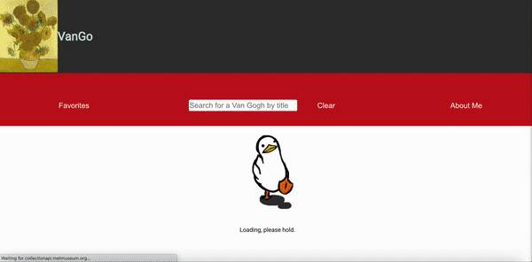
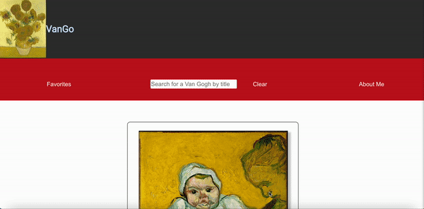
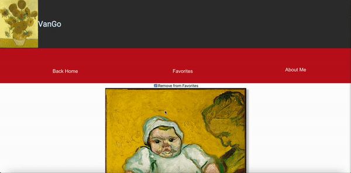

# VanGo

## Moved out of Manhattan? Really miss being a subway ride away from The Metropolitan Museum of Art now that you live in Denver, CO? Love Vincent van Gogh's artworks and not going to The Van Gogh Museum anytime soon? VanGo is the app for you! 

## Table of Contents

  - [Setup](#setup)
  - [Technologies](#technologies)
  - [Project Spec](#project-spec)
  - [Abstract](#abstract)
  - [Learning Goals](#learning-goals)
  - [Preview](#preview)
  - [WinsAndChallenges](#winsandchallenges)
  - [Authors](#Authors)
  - [FutureFeatures](#future-features)

## Setup

- Clone down this repo [here](https://github.com/bhaddad1/vango)
- Open in an IDE
- On the command line, run: $ npm install
- On the command line, run: $ npm start
- Alternatively, click this link: [link]()

## Technologies
  - React
  - React Router (v5)
  - Cypress
  - Javascript
  - RESTful API(s)
  - CSS / HTML
  - Git Version Control / GitHub
  - Webpack node package
  - VSCode

  
## Project Spec
[Click here](https://frontend.turing.edu/projects/module-3/showcase.html)

## Abstract 

### VanGo is the perfect way to view Vincent van Gogh's works displayed at The Met...on the go. Is this a niche audience? Yep. Was it a dream app I really wanted to create? Yep again. On the main page, see van Gogh's works. Search for a work by title. Learn more about the work by clicking on the work's image or title. Save it to your favorites so all of your favorite works are in one page. Head over to the About Me page to learn more about me, the creator of VanGo. 

## Learning Goals

- Solidify an understanding of React and React Router. 
- Learn to write user stories/personas and allow them to guide the styling and functionality of an app.

## Preview 

### Home Page

### Details Page

### Search Feature

### Favorite Feature

### About Me Page

## WinsAndChallenges

### Challenges
- Building the funtionality for favoriting a work. For some reason, event.target.checked was not my friend. 
- Building a cleaning function to clean the API data. Though it worked, the data was not being rendered or displaying, even though it was being stored in state. 
- Stubbing the API data in Cypress (don't even look at it).

### Wins
- Using hooks instead of class-based components.
- Implementing a favoriting feature after debugging it for five hours.
- Implementing a search feature using hooks instead of setState. 

## Future features
- Building a backend server using Express instead of making MANY single API calls. 
- Using more museums' data. 
- Local storage. 

## Author

<table>
   <tr>
      <td> Blanche Haddad (they/them) <a href="https://www.linkedin.com/in/blanche-haddad-denver/">LinkedIn</td>
    </tr>
 <td></td>
 
</table>
